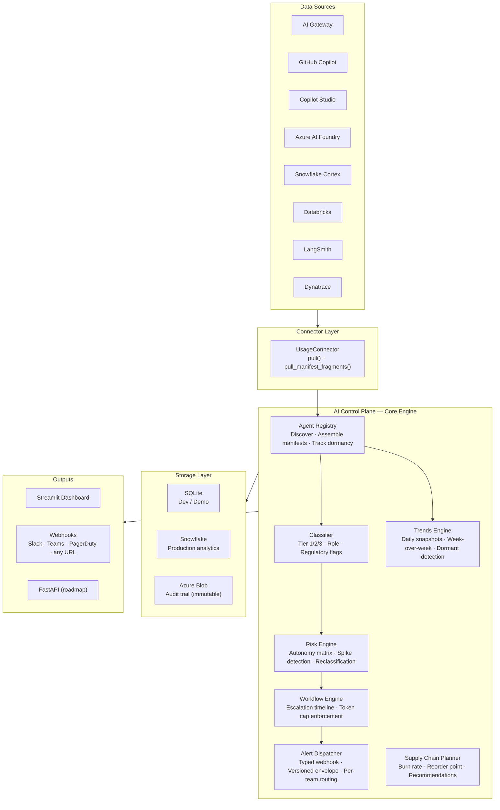
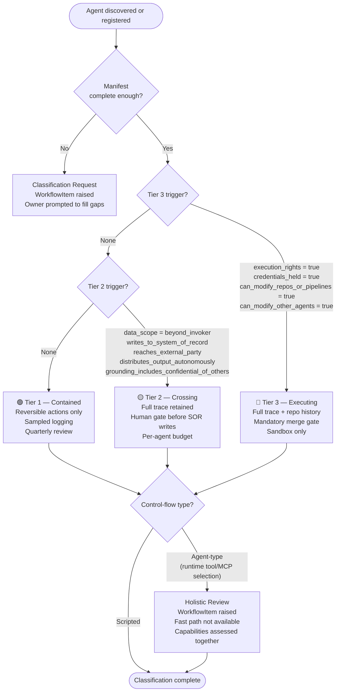
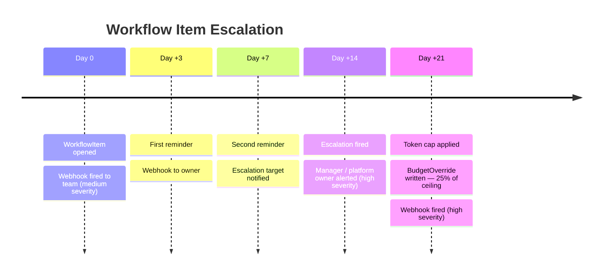
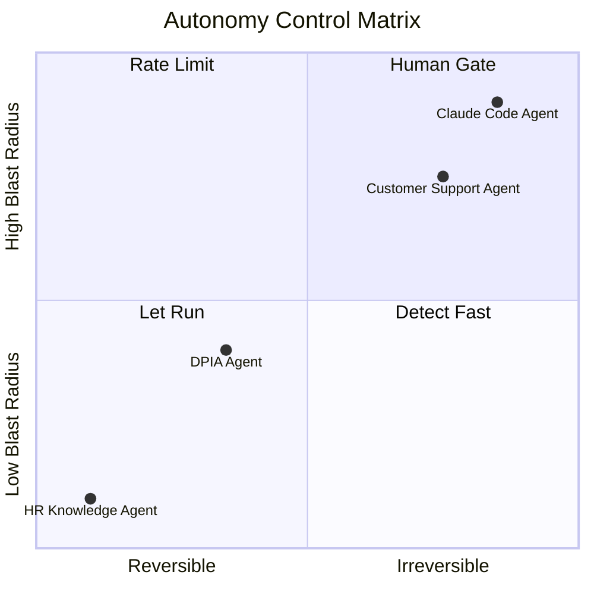
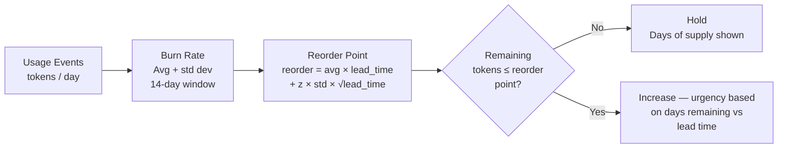
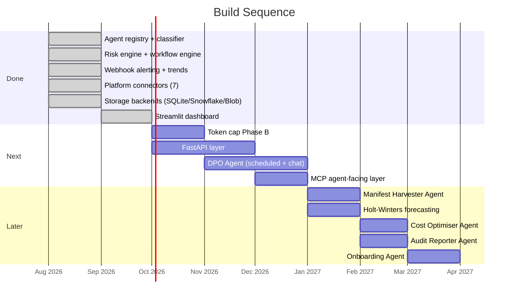

# AI Control Plane

> **Status:** Active prototype — agent registry, governance pipeline, analytics engine, and Streamlit dashboard all work end-to-end against synthetic demo data.
>
> `python3 demo.py` · `streamlit run dashboard/app.py`

A monitoring and analytics platform that gives organisations a single view across every AI agent, model, and workload in their estate — without opening five separate dashboards.

---

## The problem it solves

Most organisations adopting AI end up with usage spread across a gateway, several SaaS AI tools, and data platforms. Each is billed differently. Each has its own dashboard. Nobody has a single answer to:

- **What AI agents are running?** Who built them, what can they reach, have they been reviewed?
- **How much is being spent?** Across tools, teams, models — in one number.
- **Are we compliant?** Which agents touch personal data? Which haven't been classified?
- **Are we running out of capacity?** If purchasing PTUs or reserved throughput — when do we hit the reorder point?

This project treats each of those as the problem type it is: a discovery and classification problem, an aggregation problem, a compliance workflow problem, and an inventory management problem.

---

## Architecture



---

## Quick start

No credentials, no dependencies beyond the standard library.

```bash
git clone <this-repo>
cd ai-control-plane
python3 demo.py
```

**To open the dashboard:**

```bash
pip install streamlit plotly pandas
streamlit run dashboard/app.py
# Opens at http://localhost:8501
# Seeds automatically on first launch (~3 seconds)
```

The dashboard has five pages: Overview, Agent Registry, Analytics & Trends, Governance, and Supply Chain.

---

## How agents get classified

Every agent is classified mechanically from its manifest — what it can reach and do, not which platform it runs on. Copilot Studio, Azure AI Foundry, and a custom gateway build all go through the same rules.



**Summoner floor rule:** if an agent orchestrates sub-agents, its effective tier is `max(own_tier, max(sub_agent_tiers))`. One Tier 3 sub-agent puts the whole orchestrator at Tier 3.

---

## Governance escalation timeline

When an agent cannot be classified (manifest too sparse) or needs holistic review (agent-type control flow), a workflow item is opened and this timeline runs automatically.



All thresholds are configurable. The cap is advisory enforcement via `BudgetOverride` (Phase A). Platform API enforcement — Azure APIM rate limits, Copilot Studio quotas, Snowflake resource monitors — is the next roadmap item (Phase B).

---

## Risk assessment

After classification, each agent is assessed against an autonomy matrix based on two dimensions: how far the consequences can spread (blast radius) and whether they can be undone (reversibility).



| Control | When | What it means |
|---|---|---|
| **Let Run** | Low blast, reversible | Log and sample only |
| **Detect Fast** | Low blast, irreversible | Undo requires detection — alert on anomaly |
| **Rate Limit** | High blast, reversible | Cheap alone, systemic at scale |
| **Human Gate** | High blast, irreversible | No autonomy without prior approval |

---

## Supply chain planner (optional)

Only relevant if purchasing provisioned model capacity (Azure PTUs, reserved throughput). Skip if on pay-as-you-go.



`lead_time_days` is procurement + setup time, not just an API call. `z_score` defaults to 1.65 (95% service level).

---

## Project structure

```
core/                        Engine — no org-specific code lives here
  agent_registry.py          Discovery, manifest assembly, dormancy
  classifier.py              Rule-based tier/role/flag inference
  risk.py                    Autonomy matrix, spike detection, reclassification
  workflow.py                Escalation timeline, token cap
  alerting.py                Typed webhook dispatch, versioned envelope
  trends.py                  Daily snapshots, adoption curves, dormant detection
  burn_rate.py               Demand bucketing, reorder point calculation
  recommender.py             Burn-rate to advisory recommendation
  models.py                  Canonical schema for all entities
  ...

storage/
  base.py                    StorageBackend protocol — swap backends freely
  sqlite.py                  Dev / demo — zero setup, stdlib only
  snowflake.py               Production analytics and trend queries
  azure_blob.py              Append-only immutable audit trail

connectors/                  One file per source — implement these in your private repo
  base.py                    UsageConnector interface
  langsmith.py               LangSmith run traces
  dynatrace.py               Dynatrace AI observability spans
  github_copilot.py          GitHub Copilot seat + usage
  copilot_studio.py          Power Platform bot usage + manifest inference
  azure_ai_foundry.py        Azure Monitor metrics + endpoint manifest
  snowflake_cortex.py        QUERY_HISTORY + execution rights detection
  databricks.py              Cluster job usage (always Tier 3)
  synthetic.py               Demo fixture — realistic multi-model usage

dashboard/
  app.py                     Entry point — seeds on first launch, sidebar navigation
  seed.py                    Demo pipeline seeding (~3 seconds, no credentials)
  data.py                    Cached query layer over SqliteBackend
  pages/                     1_overview · 2_agent_registry · 3_analytics
                             4_governance · 5_supply_chain
  components/                badges.py · cards.py

tests/                       82 tests, 0 failures
docs/
  webhook-schema.md          Typed payload schemas for all 13 alert event types
```

---

## Adding your own data source

Implement `UsageConnector` in your private repo. Nothing in `core/` changes.

```python
from datetime import datetime
from connectors.base import UsageConnector
from core.models import AgentManifestFragment, UsageEvent


class MyGatewayConnector(UsageConnector):
    def source_name(self) -> str:
        return "my_gateway"

    def pull(self, since: datetime) -> list[UsageEvent]:
        # Call your gateway's usage API and normalise into UsageEvent.
        # This is the only required method.
        ...

    def pull_manifest_fragments(self, since: datetime) -> list[AgentManifestFragment]:
        # Optional. Return partial manifest data from your platform's metadata API.
        # The registry merges fragments from multiple connectors automatically.
        ...
```

Your connectors — and the real data they touch — should live in your own private repo. They carry org-specific auth and cost-centre mappings, and real usage data is typically personal data under GDPR once tied to a real person. This repo provides the engine and the interface without ever needing to see your data.

---

## Storage backends

| Backend | Use for | Notes |
|---|---|---|
| `SqliteBackend` | Local dev, demo, tests | Zero setup — standard library only |
| `SnowflakeBackend` | Production analytics | Trend queries, budget rollups at scale |
| `AzureBlobAuditBackend` | Audit trail | Append-only, immutable. Always run alongside primary backend in production |

Swapping backends is a single constructor call change. All callers depend on the `StorageBackend` protocol in `storage/base.py`.

---

## Webhook alerts

All outbound alerts use a typed, versioned envelope. Consumers check `schema_version` before parsing `payload`.

```json
{
  "schema_version": "1.0",
  "event_id": "uuid-v4",
  "event_type": "classification_request",
  "severity": "medium",
  "timestamp": "2026-01-15T09:00:00",
  "source": "ai-control-plane",
  "payload": { "agent_id": "...", "missing_fields": ["data_scope"], ... }
}
```

13 event types are defined — see [`docs/webhook-schema.md`](docs/webhook-schema.md). Alert rules are registered per team with a platform-wide fallback for unattributed agents.

---

## Requirements

### Must Have

These are the core capabilities the platform cannot function without.

| # | Requirement |
|---|---|
| M1 | Discover every AI agent running in the estate from gateway logs and platform connectors, without requiring builders to self-register |
| M2 | Classify each agent to Tier 1, 2, or 3 mechanically from its manifest — same rules regardless of platform |
| M3 | Flag classification requests when manifest data is missing, and track resolution with an escalation timeline |
| M4 | Detect and track personal data, external-facing, financially material, and market-facing regulatory obligations per agent |
| M5 | Provide a single view of spend across all AI tools, models, and platforms in USD |
| M6 | Fire typed webhook alerts for governance events (classification request, escalation, token cap) routable to any destination |
| M7 | Maintain an immutable audit trail of all classification and governance decisions |
| M8 | Support SQLite for development and Snowflake + Azure Blob for production with no code changes in callers |

### Should Have

Important for a production-quality platform but the system works without them.

| # | Requirement |
|---|---|
| S1 | Streamlit dashboard giving non-technical stakeholders visibility into agent estate, spend, and governance status without running code |
| S2 | Automatic dormancy detection — agents inactive beyond a configurable window are flagged and notified quarterly |
| S3 | Risk assessment per agent using the autonomy matrix (blast radius × reversibility) with a recommended control |
| S4 | Reclassification triggers on manifest change, new sub-agent linkage, or burn rate spike (>2σ) |
| S5 | Per-team webhook routing with platform-wide fallback — escalations reach the right owner, not a central ops inbox |
| S6 | Token cap enforcement (Phase A) via BudgetOverride when a workflow item is not resolved within 21 days |
| S7 | Model adoption trends, week-over-week deltas, and human-vs-agent demand split in the analytics layer |
| S8 | Connector reference implementations for GitHub Copilot, Copilot Studio, Azure AI Foundry, Snowflake Cortex, Databricks, LangSmith, and Dynatrace |

### Nice to Have

Valuable additions that extend the platform's reach but are not blocking.

| # | Requirement |
|---|---|
| N1 | **DPO Agent** — standalone agent with scheduled jobs (daily/weekly/monthly/quarterly) that proactively contacts owners when personal data obligations are unmet, and answers compliance questions interactively |
| N2 | **Token cap Phase B** — enforce budget ceilings at the platform edge (Azure APIM rate limits, Copilot Studio quotas, Snowflake resource monitors) rather than advisory BudgetOverride only |
| N3 | **FastAPI layer** — REST API over the engine so multiple teams and downstream agents can consume governance data without DB access |
| N4 | **MCP agent-facing layer** — read tools open to agents; write actions (budget changes, capacity approvals) always two-step: propose then human-confirm |
| N5 | **Manifest Harvester Agent** — auto-infers missing manifest fields from platform APIs and presents a draft to the owner for one-click confirmation, reducing time-to-classification |
| N6 | **Supply chain planner** — burn rate tracking, reorder-point calculation, and advisory recommendations for organisations purchasing provisioned capacity (Azure PTUs). Skippable on pay-as-you-go |
| N7 | **Cost Optimiser Agent** — identifies over-specified models, dormant pools, and deprecated model traffic. Monthly cost-avoidance report per team |
| N8 | **Holt-Winters forecasting** — replaces the rolling-average burn rate with seasonal demand forecasting for established models |
| N9 | **Audit Reporter Agent** — generates quarterly compliance packs (classification status, DPIA register, regulatory flag summary) and deposits them to SharePoint / email on schedule |
| N10 | **Onboarding Agent** — chat interface for builders: answers "what tier will my agent be?", guides manifest completion, and runs a pre-build governance check before any code is written |

---

## Roadmap



---

## Design principles

**Tier is assigned from configuration, not platform.** Copilot Studio, Azure AI Foundry, and a custom gateway build all go through the same classifier. Platform is context, not a classification input.

**USD is the common unit for spend; tokens for supply planning.** Snowflake and Databricks don't bill in tokens, and GitHub Copilot / M365 Copilot are seat-based. USD is the only unit all sources share.

**Recommendations, not automated enforcement.** The supply chain planner surfaces recommendations for a human to act on. The governance engine applies a budget cap at Day +21 as a signal, not a hard block. Platform API enforcement is a roadmap item, not the default.

**Audit events are never silently lost.** `append_audit_event` in both the Snowflake and Azure Blob backends logs at `ERROR` and re-raises on failure. The SQLite copy is queryable; the Blob copy is authoritative and immutable.

**Public/private split is intentional.** `core/`, `storage/`, and `connectors/` are fully generic. Your connectors — with org-specific auth, cost-centre mappings, and real usage data requiring data-protection review — live in your private repo.

**"Copilot" is always fully qualified.** GitHub Copilot, M365 Copilot, Copilot Studio, and M365 Cowork are distinct products with distinct billing models and usage APIs. `SourceApp` values reflect this everywhere.

---

## Automated code review

This repository uses [PR Agent](https://github.com/The-PR-Agent/pr-agent) for automated PR review. Every PR receives a review within 1–2 minutes of opening.

| Setting | Value |
|---|---|
| Auto-review | On — comprehensive code review on every PR |
| Auto-describe | On — generates PR title, summary, and labels |
| Model | Claude Opus 5 via Anthropic API |

Use `/review` to trigger manually or `/disable` to skip a specific PR.

---

## License

MIT — see [LICENSE](LICENSE).
