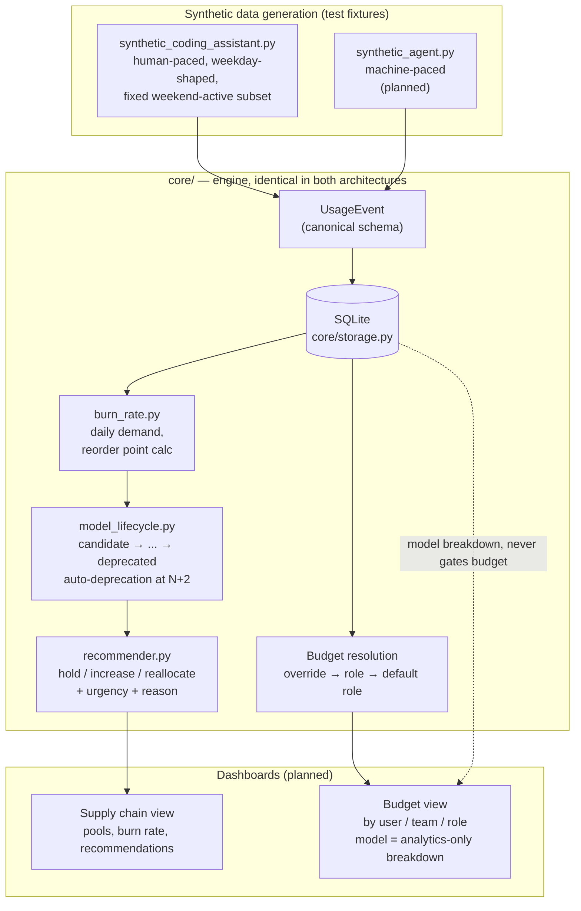
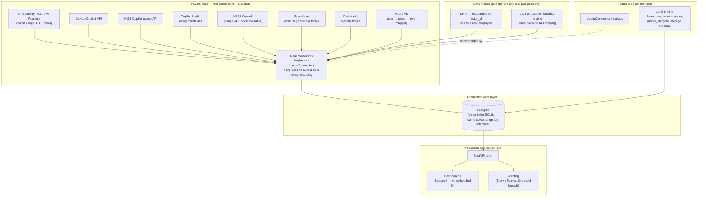
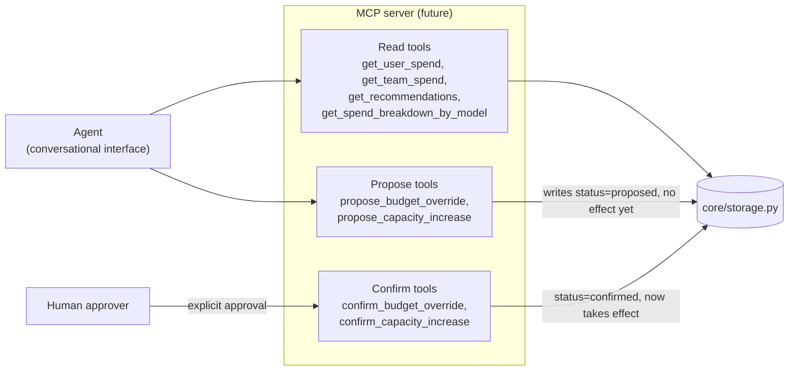

# Architecture

Two diagrams, deliberately kept separate: what's actually built for the
hackathon (synthetic data, local, public-repo-safe), and what a go-to-market
version looks like (real connectors, real data, private, with the
governance step that implies). The gap between them is intentional — see
[Hackathon → go-to-market: what changes](#hackathon--go-to-market-what-changes)
at the bottom.

## Hackathon architecture (as built)

Everything here runs on synthetic data, locally, with zero credentials —
this is what `python3 demo.py` and the current test suite exercise.

**Why this shape:** the synthetic generators and the SQLite storage layer
are the only pieces that wouldn't survive contact with real data as-is —
everything in `core/` is written against the canonical schema, not against
"synthetic" anything, which is what makes the go-to-market swap (below) a
substitution rather than a rewrite.

## Go-to-market architecture (target state)

Same `core/` engine. What changes is everything upstream of it — real
connectors, real identity, and the governance gate that real personal data
requires. The public repo (left of the dashed line) never needs to change
to support this; only the private repo (right of the line) is new.

**What's genuinely new here, not just "real instead of fake":**

- **The governance gate has no hackathon equivalent** — it's not a step
  that gets faster with real data, it's a step that doesn't exist at all
  until real data is involved. See the section below.
- **AD becomes a real input**, not a synthetic mimic — user → team → role
  mapping needs to come from an actual directory sync, not a generator.
- **Postgres replaces SQLite** — purely an operational swap if `core/storage.py`
  stays the seam everything goes through; a rewrite if anything upstream
  started talking to SQLite directly instead.

## Hackathon → go-to-market: what changes

| | Hackathon | Go-to-market |
|---|---|---|
| Data | 100% synthetic, generated | Real usage pulled from each source |
| Identity | Synthetic AD-shaped mock | Real Azure AD sync |
| Storage | SQLite, local file | Postgres, access-controlled |
| Governance | None needed — no personal data exists | DPIA required before any real connector goes live |
| Repo | Public | Connectors + real data stay in a private repo; `core/` stays public and unchanged |
| Connectors | `synthetic_coding_assistant.py`, `synthetic_agent.py` (test fixtures) | One `UsageConnector` implementation per real source |

The point of building the hackathon version against the exact same
`UsageEvent`/`CapacityPool` schema and the same `core/storage.py` interface
is that this table is the *only* thing that changes — nothing in `core/`
should need to be touched to go from left column to right column. If a
go-to-market change ever requires editing `core/burn_rate.py` or
`core/recommender.py` specifically to accommodate real data, that's a sign
the schema wasn't actually source-agnostic and is worth revisiting.

## Agent-facing layer (future, not yet built)

`UsageConnector` is deliberately *not* MCP — it's a fixed, statically-known
set of scheduled batch pulls, and MCP's value (dynamic tool discovery,
natural-language-driven invocation) doesn't apply to "call every connector
on a timer." Where MCP does fit is a layer on *top* of everything above:
an agent that can answer "why did my team's spend spike" by querying
`core/storage.py`, or that can act on a recommendation rather than just
displaying it — increasing a budget limit, or greenlighting a capacity
purchase, on someone's behalf.

**Design constraint, not a detail:** write actions are always two-step —
`propose_*` creates a pending row with no effect, `confirm_*` is the only
path that actually changes a budget or triggers a capacity action, and
`confirm_*` is only ever called by an explicit human approval, never by
the agent autonomously. This is the same boundary already built into
`core/recommender.py` (recommendations, not automated purchases) applied
to budget limits as well — an agent proposing "increase Alice's budget to
$300" is materially different from an agent silently doing it, and the
former is the only version worth building. Getting this boundary right
matters more than getting the agent UX right, so it's worth deciding
before any code here is written, not after.

**What this needs from the schema when it's actually built:** a `status`
column (`proposed | confirmed | rejected`) on `budget_overrides`, and
equivalently on whatever table eventually backs capacity actions — a small,
additive schema change, not a redesign, since nothing about the read path
above changes.
